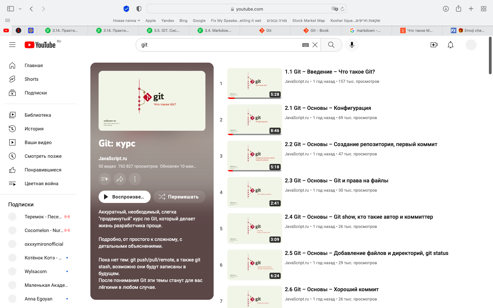

[< к содержанию](./readme.md)

[< к предыдущей странице](./repository.md)

[< к следующей странице](./motivation.md)

## Полезная информация


На сегодняшний день существует множество информации по работе с сервисами Git, GitHub и многими другими, а главный плюс - **она бесплатна и легко доступна**.


```bash=
Официальный сайт Git. На нем вы сможете узнать всю информацию, начиная от истории создания и заканчивая всеми подробностями внутренней работы системы.
```




 ```bash=
Целый курс на YouTube по практическому применению навыков и знаний, с подробным объяснением и интересными фактами.
```

Помимо этого существуют даже бесплатные курсы по обучению навыкам пользования GIT.